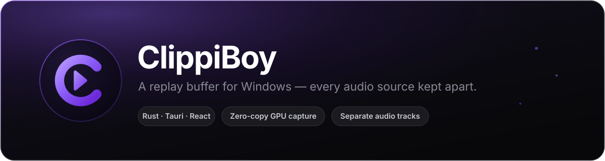
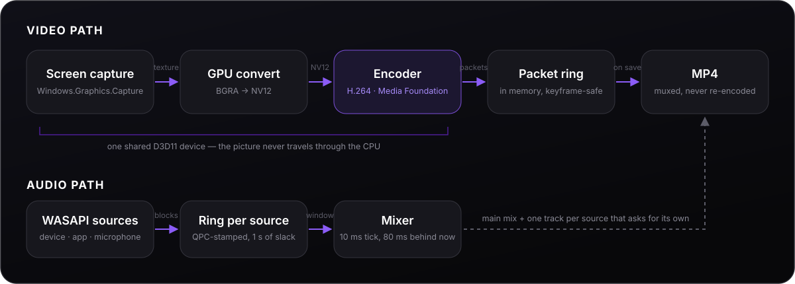
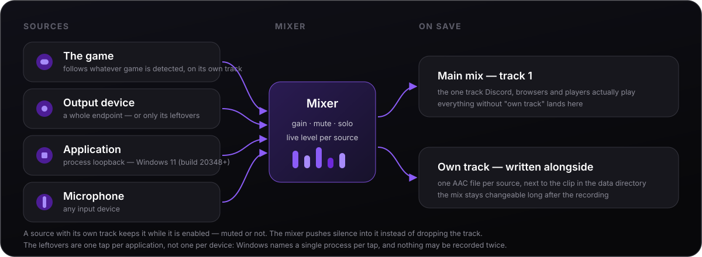

# ClippiBoy

<div align="center">



<p>
  
  
  
  
</p>

</div>

**ClippiBoy** records the last few minutes of your game the moment you decide they
were worth keeping. A hotkey, one to two seconds, and the clip is in the folder.

What sets it apart from the usual replay recorders is the audio. Several sources
run at once — output devices, individual applications via process loopback, and
microphones — and each of them either goes into the main mix or gets a track of
its own inside the clip. Discord too loud in the highlight? Turn it down
afterwards. In ClippiBoy itself, without an editor.

---

## Features

| | |
|---|---|
| **Replay buffer** | One encoder runs continuously, the packets live in memory, saving cuts them out — nothing is re-encoded |
| **Per-source audio** | The detected game, devices, applications and microphones side by side, each with gain, mute, solo and a live level |
| **Game on its own** | The game's audio follows the detected game by itself, and "everything else" picks up the rest — so nothing lands in the clip twice |
| **Separate tracks** | Sources with their own track are written alongside the clip; the mix stays changeable afterwards |
| **Zero-copy capture** | The picture goes from Windows.Graphics.Capture into the hardware encoder as a D3D11 texture |
| **Clip editing** | Name, description, game, track mix and a frame-accurate trim — all inside the app |
| **Screenshots** | Own hotkey, own folder, own gallery, plus a non-destructive editor: crop, marks, blur |
| **Banner over the game** | A transparent overlay that reports saved clips without stealing focus or clicks |
| **Game detection** | By process, not by window title, with a name list you can extend without rebuilding |
| **Tray and automation** | Close to tray, start with Windows, buffer on its own — optionally only while a game runs |

---

## Installing

Grab the installer from the [Releases](../../releases) page and run it. It
installs per user, so no administrator is needed, and brings its own ffmpeg
along.

Requirements: Windows 10 or 11 and WebView2, which ships with Windows 11 and
arrives through Windows Update on 10. Nothing else.

One caveat on 10: capturing a **single application's** audio needs the process
loopback API, and that arrived with Windows 11 (build 20348). Output devices and
microphones work on 10 as they do everywhere.

Updates come from the same Releases page. The app checks once at startup and
then leaves you alone: installing means quitting and starting the installer, and
in the middle of a recording that is exactly the wrong moment. The find shows up
in the settings under *Version*, where one button does the rest — a running
buffer is stopped cleanly first.

## Hotkeys

| Shortcut | Does |
|---|---|
| `Ctrl` + `Shift` + `B` | Buffer on / off |
| `Ctrl` + `Shift` + `S` | Save clip |
| `Ctrl` + `Shift` + `P` | Screenshot |

All three can be rebound to anything in the settings, including keys with no
modifier at all — `F9`, say. A bare letter key then applies everywhere, chat
included, so pick with care.

The ✕ does not quit the app but drops it into the tray. From there the buffer
can be switched, a clip saved and the window brought back; the tooltip shows the
buffer level and the game that was detected. Quitting happens through *Quit* in
the tray menu.

Starting ClippiBoy while it is already running does not open a second one: the
new process hands its arguments to the one already there and ends itself, and
that one brings its window up. Anything else would be two apps fighting over the
same hotkeys, the same tray icon and the same graphics card — and the second one
would look like the app had simply forgotten the running buffer.

---

## How the replay buffer works

<div align="center"></div>

**One** encoder runs continuously and its finished packets land in a ring in
memory. On save the matching packets are cut out, written as a raw H.264
elementary stream and packed together with the audio into an MP4 in a single
ffmpeg run (`-c:v copy`). Nothing is re-encoded, so a clip is ready in one to
two seconds.

The ring always cuts at a keyframe at the front — a clip that started in the
middle of a group of pictures would have blocky artefacts at the beginning.
Older packets fall away continuously, so exactly the configured length is kept.

The video reaches the hardware encoder as a Direct3D texture and is never copied
through the CPU. Capture and encoder share one D3D11 device for that, and the
graphics card's video processor does the BGRA→NV12 conversion.

<details>
<summary><b>Why the buffer no longer lives on disk</b></summary>

<br>

It used to be 10-second MPEG-TS segments, stitched together with `ffmpeg concat`
on save. That had three costs, all of them now gone:

* Every segment change needed a new encoder. Setting one up takes longer than a
  frame interval, so the next one had to be pre-built in the background — and
  even then a hole of 60 to 300 ms tore into the video at every boundary, adding
  up over a clip into a drift between picture and sound.
* A segment that produced no file — because not a single frame arrived with a
  still picture, say — made **every** further save fail as long as it sat in the
  ring.
* The buffer was permanently on disk, and a version that crashed left it lying
  there. On the first start of a new one, `buffer/` is therefore cleared away.

</details>

Audio and the buffer's clock hang off a thread of their own that runs every
10 ms, not off the frame callback. Windows.Graphics.Capture only delivers a
frame when the picture changes: with everything on the callback, a still picture
would starve the audio and stall the buffer. For the same reason a separate
thread clocks the frames at `1/fps` and re-sends the last one during a still
picture — the encoder therefore sees true CFR instead of a frame rate it would
have to convert itself. That was exactly the judder. The zero point for both
tracks is the first frame that arrived, so audio and video share one time origin.

The audio rings run from program start for the level meters, but are emptied
before every recording. Without that they would stand at their limit — a whole
second of audio nobody ever collected — and the clip would run behind the picture
from the very first second.

While it runs, the mixer deliberately stays **80 ms behind the present**. WASAPI
only hands a block over once it is full; mixing closer to now would fetch silence
where real audio arrives a moment later, and by then its slot in the track is
already taken.

---

## The audio system

<div align="center"></div>

Four source types:

* **The game** — whatever game detection has found, on its own track. It
  follows the game by itself: no PID to pick, and a restart of the game
  does not break it. It also holds on while you alt-tab away, and only lets go
  once the process is really gone.
* **Output device (loopback)** — an endpoint's complete audio, or only what the
  other sources leave over; see below
* **Application** — process loopback via `ActivateAudioInterfaceAsync`, so
  Discord can sit apart from the game (needs Windows 11, build 20348+)
* **Input device** — microphone

Nothing is filtered out of a finished mix — that would leave residue. Windows
mixes the applications together only at the very end, and process loopback taps
*before* that. Every source is an independent tap, cleanly apart from the others.
Playback is untouched, you keep hearing everything.

### The leftovers — no setting, just a consequence

An application that has its own track and is *also* inside a whole recorded
device is in the clip **twice**. Muting that track afterwards then does not
remove the sound, because it sits in the main mix as well.

So as soon as anything is recorded application by application — the game, or a
single application you picked — every output device records only what those leave
over. There is nothing to switch on: it follows from the sources, and switching
it off would only ever produce the doubling. While nothing is recorded that way,
a device is simply that device.

Behind it, the source stops being one endpoint loopback and becomes one tap per
application on that device that nothing else records. Applications are grouped by
process tree, because a tap covers a process *and its children* — Discord holds
two sessions in two child processes and is still recorded exactly once. ClippiBoy
leaves itself out, so previewing a clip while the buffer runs does not end up in
the next one.

Every output device takes part, and **which application goes where is decided by
Windows, not by you**. A session reports whether it is *rendering* or merely
open, and that is precisely the difference between "this plays on that device"
and "it opened a stream there once and left it lying". So an application lands on
the device it is audibly playing on.

That matters with a hardware mixer, where routing is the whole point: the default
output device lists a session for nearly everything, so going by sessions alone
it would swallow the lot. Going by what is *rendering*, Discord lands on the chat
channel, the game on the game channel, the browser on the default one — the
routing set up in the mixer, read back rather than guessed.

Two rules fill the gaps. An application playing nowhere in particular — Steam
sits open on every device without a sound — goes to the default device, the
catch-all. And one that falls silent for a moment stays where it is instead of
moving and cutting its stream.

What cannot be done is splitting an application *by* device.
`AUDIOCLIENT_PROCESS_LOOPBACK_PARAMS` names a process and nothing else, and
Microsoft says so plainly — *"The capture is not tied to a specific audio
endpoint."* An application really playing on two devices at once therefore lands
on one of them, whole.

The price is a thread and a one-second ring per application, and that an
application which has just started playing joins within two seconds — the same
tick that watches for the game. Which applications a device actually holds is
written on it, since the device alone no longer tells you.

Every source has gain, mute, solo and a live level. Sources without *own track*
run into the main mix; the others land beside the clip on save, as a file of
their own. If every source has a track of its own, nothing is left for the main
mix — then the clip has none, rather than a slider in the editor that moves
nothing.

The main mix is **not recorded as a mix**. Every source has a ring of its own in
the buffer, including the ones that have no track of their own, and the sum is
drawn only when a clip is saved, out of whatever runs into the main mix at that
moment. That is what makes the ⧉ switch reach backwards: flip it while the
buffer is running and it applies to the whole clip, not just to the seconds
after the click. Recorded as a sum, the past could never be taken apart again —
and switching back would have thrown away the minutes already recorded for that
source.

A ring per source sounds like more memory than one shared one, and as an upper
bound it is: 192 kB per second and source. But **silence is counted, not
stored** — the quiet blocks only raise a number, and it becomes the zeros it
stands for the moment sound arrives again, sample for sample. A source quiet for
longer than the buffer is long hands its memory back entirely. Which is the
normal state of most of them: a device nobody plays on, a microphone on mute, a
chat channel between two sentences. Six sources on a 90-second buffer are 99 MB
if everything is loud at once, and around 49 MB while a game, a chat and a
microphone are actually running.

The sources are dragged into order by the grip on the left of each row (or moved
with ↑/↓ once it has focus). That order is the order of the tracks in the clip —
and where the rule above leaves a tie, because an application really renders on
two of the devices at once, the source standing higher gets it.

That the dragging works at all is down to one line in `tauri.conf.json`:
`dragDropEnabled: false`. With the default WebView2 grabs drag and drop for
itself on Windows, so it can report dropped files to the app — and the HTML drag
events then never reach the page. The app takes no files by drag anyway.

A source with its own track keeps that track as long as it is enabled — even
while it is muted or another one is soloed. The mixer pushes silence into it
then. Anything else would mean that muting throws the source out of the buffer
**retroactively**, and that every step of a volume slider costs the minutes of
that track buffered so far.

The clip itself carries exactly **one** audio track. Discord, browsers and most
players stubbornly play only the first track of an MP4 — with the microphone and
Discord beside it as separate tracks, they were silent everywhere outside an
editor. So the raw individual tracks sit next to the clip instead, one folder per
clip in the app data directory, and the mix can still be changed at any time.

<details>
<summary><b>What the tracks cost, and how the preview stays honest</b></summary>

<br>

The tracks stay **untrimmed** and always live in coordinates of the untouched
recording. That is deliberate: they are never replaced, there is no second
timeline that can run away, and Windows cannot lock an open file on you. The
price is one number that has to be right — the offset between track and video.

The preview mixes over WebAudio. WebView2 cannot reach `audioTracks`, so the UI
runs the tracks as audio elements of their own in sync with the video. Their
`volume` can only attenuate, never boost, so every slider above 0 dB would have
lowered the *other* tracks instead of raising its own. The tracks therefore run
through a small WebAudio graph: one `GainNode` each, then a master and hard
clipping at ±1 — the same as what happens on save. Preview and finished clip
sound alike.

The tracks live on a different origin than the UI, and without
`crossOrigin = "anonymous"` a `MediaElementSource` outputs **silence** with no
error message at all. In case it happens anyway, an `AnalyserNode` listens in and
falls back to the old route over `volume` after two seconds without a sample.

</details>

---

## Editing clips

The player has no edit mode. The pane beside the picture is always open, and
whatever is set in it the core remembers on the clip:

* **Name, description, game** — these land in the clip database, not in the file
  name; the file keeps its own. The gallery's search finds all three. The name
  can also be changed without the player: click it in the gallery, it comes up
  selected, Enter saves, Escape discards.
* **Audio tracks** — one slider per track from −30 to +12 dB, plus a mute switch.
* **Trim** — `I` and `O` set start and end to the current position, and the
  handles on the timeline can be dragged too. Playback jumps back to the start of
  the selection when it reaches the end.
* **Save** — writes both into the file: the mix **and** the trim. What lies in
  the folder afterwards is the finished clip, ready to send as is.

Nothing is lost on the way. On the first real cut the untouched recording moves
into the app data directory and the pane offers **Undo trim** — one click and the
whole clip is back. Trimming further inwards works without undoing first; the
handles run over the trimmed file's timeline while the arithmetic happens in the
original.

**A trimmed clip needs twice the space** for as long as that original sits beside
it. It disappears as soon as the trim is undone or the clip is deleted.

> **Shortening at the back is lossless, at the front it is not.** A cut that
> starts at zero only copies the video and is done in a second or two. A cut at
> the start has to be frame-accurate — copying would slide it to the keyframe
> before, up to two seconds too early — so the video is re-encoded, with the
> encoder from the settings and x264 as a fallback if the hardware refuses. The
> arithmetic always works from the original, never from the already-trimmed file,
> which keeps the loss at one generation even after trimming three times over.

---

## Order in the clip folder

Every game gets a folder of its own, favorites go into `Favorites`, and whatever
has no game stays directly in the clip folder. One level further down the kind
splits the two apart, so recordings and stills never lie mixed together:

```
Videos\ClippiBoy\
  Videos\                        ← no game
  Screenshots\
  Counter-Strike 2\
    Videos\
    Screenshots\
  Favorites\                     ← everything with a heart, across all games
    Videos\
    Screenshots\
```

If a clip's game or its heart changes, the file moves along. Two rules for that:

**Nothing is moved while the clip is still open.** The player holds the file
during playback, and pulling it out from under it would tear the video off. The
gallery catches up as soon as the player closes, and whatever went wrong in the
process is cleaned up on the next start. The gallery is right in the meantime
regardless: it reads from the database, not from the file system.

**Only what lies in the configured clip folder is touched** — directly in it or
up to two levels down, which is as deep as `<game>\Videos` goes. Whoever changes
the storage location deliberately leaves their existing clips where they are.
Folders that have become empty disappear by themselves; the clip folder itself
never does.

A **favorite is a category at the same time**: the file lives in `Favorites`
while the clip stays findable under its game inside the app — both are filters
over the same database.

Game names are made safe for a folder: forbidden characters become a space and
runs of whitespace collapse into one (`Hitman:Absolution` → `Hitman Absolution`),
trailing dots and spaces fall away, reserved names like `CON` get an underscore
in front, and after 60 characters it stops. Game names sometimes come from window
titles, and those can be whole sentences.

Thumbnails do not sit beside the clip but in the app data directory. The clip
folder belongs to the user and should hold nothing but videos — whoever opens it
wants to see clips, not half an image file for each one.

---

## Details worth knowing

<details>
<summary><b>When the buffer runs</b></summary>

<br>

By default not on its own — the buffer goes on via hotkey, tray or the button in
the app. Under *Behaviour* in the settings that can be changed:

* **Start the buffer automatically** — the automation takes over.
* plus **Only buffer in game** on: the buffer starts as soon as a game is
  detected in the foreground and stops 30 seconds after none is left. The half
  minute of run-on is deliberate — a brief alt-tab must not choke the recording.
* plus **Only buffer in game** off: the buffer runs from the app's start onwards,
  whatever is in the foreground.

What you switch yourself always wins: a buffer started by hand is never stopped
automatically, and one stopped by hand is not restarted two seconds later. The
automation holds back until the game has ended.

**Start with Windows** registers the app for auto-start, and it then comes up
hidden in the tray. Together with the automation, recording runs without you ever
seeing a window.

</details>

<details>
<summary><b>Game detection</b></summary>

<br>

Detection goes by the **process** behind the foreground window, not by its title:
titles change during play, and many games do not set one at all. If the exe is in
the built-in list, the name is certain. An unknown application counts as a game
when its window fills the whole monitor, and the tidied-up window title is used
then.

Custom names without a rebuild: put a `games.json` into the app data directory,
and it is layered on top of the built-in list.

```json
{ "mygame.exe": "My Game" }
```

The check runs every two seconds. On save, what counts is the game that was
running *while buffering* — otherwise the clip would say "ClippiBoy" whenever you
save it from the window.

</details>

<details>
<summary><b>Resolution and frame rate</b></summary>

<br>

Both follow the chosen source. The resolution is capped at the source's height
and the width computed from its aspect ratio, not from an assumed 16:9. The frame
rate offers the usual steps only up to the screen's refresh rate — plus that rate
itself, so a 165 Hz panel really does give 165. Capturing more frames than the
screen puts out makes no motion smoother; it only produces duplicate frames that
cost bitrate. For a window, the screen it sits on counts.

A setting that no longer fits gets straightened out: switching from a 165 Hz
monitor to a 60 Hz second screen leaves you with 60 there, rather than a number
the panel can never show.

</details>

<details>
<summary><b>The banner over the game</b></summary>

<br>

A second, transparent window that stays on top, takes no focus and catches no
mouse clicks. It appears on the monitor currently being played on and reports
saved clips, buffer on/off and errors — each of them switchable off individually.

The banner sticks to a fixed screen so it does not jump between monitors;
optionally it follows the foreground window. The fade-in is an outline that draws
itself once around the card and then fades out — pure compositor animation, so it
does not stutter when the game needs the GPU.

Over a game in **exclusive** fullscreen it cannot appear: that would need a
present hook inside the game process, and that is exactly what ClippiBoy
deliberately does not do. In borderless fullscreen and windowed mode — so in
practically every current game — it works.

</details>

<details>
<summary><b>The right-click menu</b></summary>

<br>

WebView2's built-in menu — *Back*, *Reload*, *Print*, *Inspect* — is switched off
throughout the app. It offers not a single useful action and looks like a browser
that got lost. Two menus of our own in the UI's style take its place.

**On a clip:** Open · Open in default player · Rename · Favorite · **Copy clip** ·
Copy path · Show in folder · Delete. *Copy clip* puts the **file** on the
clipboard, not its path — in Discord or WhatsApp, `Ctrl+V` then attaches the
clip; in Explorer it drops a copy. The format for that is `CF_HDROP`, and no
WebView can do it.

**In text fields:** Cut · Copy · Paste · Select all. The text goes through the
core rather than `navigator.clipboard`, because reading the clipboard asks for
permission in the WebView and that dialog does not belong in an app that is
native anyway.

The menu deliberately takes no focus, since the text field underneath would
otherwise lose its selection and the editor would save on blur mid-operation. So
the keyboard runs through the document instead.

</details>

<details>
<summary><b>Deleting</b></summary>

<br>

Deleting takes the file off the disk — not into the recycle bin, and there is no
undo. So nothing deletes on the first click: the bin on the tile and the Delete
button in the player turn into a question in their own place, with a tick and a
cross beside it. Escape or the cross keeps the clip. The confirm button is
deliberately **not** focused, so a stray Enter cannot finish what a stray click
started.

Gone with the clip are its thumbnail, its separated audio tracks and, if there is
one, the untrimmed original — none of them are of any use on their own.

</details>

<details>
<summary><b>Motion</b></summary>

<br>

The interface moves in one vocabulary: four curves in `src/styles/tokens.css` and
one set of keyframes in `src/styles/motion.css`. Everything runs on `opacity` and
`transform` alone, so nothing costs a layout pass while a game is running next
door — the same rule the banner follows.

The marker in the nav bar travels to the tab you picked instead of switching off
here and on over there; the gallery introduces itself once per session and then
just shows the clips; a deleted tile fades where it stood and the rest slides into
the gap; the heart lets a single ring go and is done. Whatever `prefers-reduced-motion`
asks for is honoured throughout: every animation still ends in its final state,
only the journey is skipped.

No animation library — the same reason there is no icon library. The whole
vocabulary is about two hundred lines of hooks and three small components.

</details>

---

## Building from source

Builds happen on Windows: the core talks to Windows.Graphics.Capture, Media
Foundation and WASAPI directly, so there is no cross-compile.

```powershell
git clone https://github.com/EinFabo/clippiboy.git
cd clippiboy
npm install
npm run ffmpeg       # fetches ffmpeg.exe/ffprobe.exe into src-tauri\resources
npm run app          # dev mode with hot reload
npm run app:build    # NSIS installer into src-tauri\target\release\bundle
```

You need Node 20+, Rust with the MSVC toolchain, the Visual Studio 2022 Build
Tools with the C++ workload, and WebView2. ffmpeg does **not** have to be
installed: `npm run ffmpeg` puts a tested build next to the app, and that one
takes precedence over anything on the `PATH`.

The UI alone runs anywhere, with mock data instead of a core:

```bash
npm run dev          # http://localhost:1420, mock data from src/lib/mock.ts
```

And the parts that are pure logic can be checked without Windows:

```bash
cd src-tauri
cargo test --lib                            # buffer, mixer, filing and DB logic
cargo check --target x86_64-pc-windows-gnu  # type-checks the Windows code too
```

From WSL that check aborts with `Inconsistency detected by ld.so` inside a build
script when the target directory sits on the Windows disk — WSL cannot start
every binary from there. Redirect it once:

```bash
export CARGO_TARGET_DIR=~/.cache/clippiboy-target
```

### Releases

Pushing a `v*` tag builds, signs and publishes through GitHub Actions. Packages
are signed for the updater: the public key sits in `tauri.conf.json`, the private
one never enters the repository and is passed to the workflow through the secrets
`TAURI_SIGNING_PRIVATE_KEY` and `TAURI_SIGNING_PRIVATE_KEY_PASSWORD`. If that key
is lost, no existing installation can accept an update any more.

```powershell
# bump the version in package.json and src-tauri/tauri.conf.json first
git tag v0.2.0
git push origin v0.2.0
```

Locally the key lives under `%USERPROFILE%\.clippiboy\updater.key` with its
password beside it in `updater.password` — the two secrets are the contents of
those files. Building and signing by hand, should Actions be out of reach:

```powershell
$env:TAURI_SIGNING_PRIVATE_KEY = "$env:USERPROFILE\.clippiboy\updater.key"
$env:TAURI_SIGNING_PRIVATE_KEY_PASSWORD = Get-Content "$env:USERPROFILE\.clippiboy\updater.password"
npm run app:build
```

Without the password in the environment the build stops and asks for it
interactively.

---

## Project layout

```
src/                          React UI
  lib/types.ts                IPC types — counterpart to src-tauri/src/model.rs
  lib/ipc.ts                  typed command wrappers
  lib/mock.ts                 mock data for browser mode
  lib/useClipMix.ts           plays the extra audio tracks in sync with the video
  store.ts                    Zustand store, talks to the core
  routes/                     Overview, Clips, Audio mixer, Recording, Settings
  components/ClipPlayer.tsx   player over the gallery
  components/ClipEditor.tsx   editing pane: metadata, tracks, export
  components/ClipMeta.tsx     name, description, game — shared by both viewers
  components/clipMenu.tsx     the entries of a clip's right-click menu
  components/ShotViewer.tsx   screenshot viewer over the gallery
  components/ShotAnnotate.tsx non-destructive editor: crop, marks, blur
  components/ui/Menu.tsx      right-click menu (one menu, global)
  components/TextMenu.tsx     WebView menu off, own menu in text fields
  components/SourceTrouble.tsx  audio sources that do not run, or run doubled
  components/NavBar.tsx       the sidebar, components/TitleBar.tsx the frame
  components/Toasts.tsx       short notices, components/icons.tsx inline icons
  styles/tokens.css           colours and radii, styles/motion.css the timings
  overlay/                    a window of its own: the banner over the game

src-tauri/src/
  model.rs                    shared data types
  state.rs                    shared state; buffer automation and its run-on
  pipeline.rs                 capture → encoder → packet ring
  wgc.rs                      Windows.Graphics.Capture, frames as D3D11 textures
  gpu.rs                      D3D11 device, shared by capture and encoder
  convert.rs                  BGRA→NV12 on the GPU + clock for true CFR
  mft.rs                      H.264 encoder as a Media Foundation Transform
  buffer.rs                   keyframe-safe packet ring (+ unit tests)
  muxer.rs                    packets + audio tracks → MP4 (ffmpeg, no re-encode)
  stems.rs                    store, extract and mix individual tracks (+ tests)
  edit.rs                     rewrite a clip: mix + trim (+ tests)
  preview.rs                  throwaway helper files (waveform for the timeline)
  audio/capture.rs            WASAPI per source (device, loopback, process)
  audio/engine.rs             running streams, levels, mixing
  audio/ring.rs               ring buffer per source (+ unit tests)
  audio/devices.rs            WASAPI endpoints and processes with an audio session
  audio/mod.rs                track layout, source resolution, gain (+ unit tests)
  capture.rs                  monitors and windows as capture targets, incl. Hz
  game.rs                     game detection (+ unit tests)
  games.json                  exe → game name
  tray.rs                     tray icon, menu, tooltip
  overlay.rs                  driving the overlay window
  encode.rs                   encoder detection (NVENC/AMF/QSV/x264 via DXGI)
  clipboard.rs                Windows clipboard: file (CF_HDROP) and text
  clips.rs                    SQLite clip index
  filing.rs                   order in the clip folder (+ tests)
  shot.rs                     one frame from the GPU into a PNG
  thumbs.rs                   thumbnails
  config.rs                   configuration as JSON
  commands.rs                 Tauri commands
  updater.rs                  update check and installation

src-tauri/examples/
  record-probe.rs             run capture → encoder → muxer once by hand
  tracks-probe.rs             two parallel track requests on the same clip
  trim-probe.rs               trim, measure, undo, measure

scripts/fetch-ffmpeg.mjs      fetch ffmpeg/ffprobe for the package
scripts/make-icons.py         every icon size from icons/icon.png
```

## Status

Everything above is built and running. Upload — sharing a clip straight from the
app — is the one piece still open.
